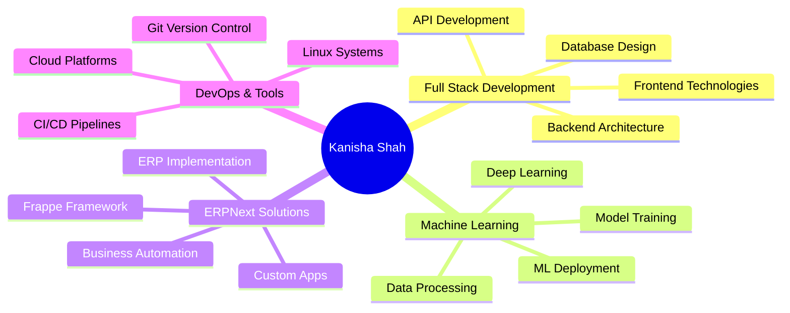

<div align="center">


</div>

<div align="center">
  
### 🚀 Transforming Ideas into Intelligent Solutions
  


<br>

<p>
  
  
  
  
</p>

[](https://linkedin.com/in/kanisha-shah-6049a4285/)
[](#)
[](mailto:your.email@example.com)

</div> 

---

## 🎯 About Me

```typescript
const kanisha = {
    location: "India 🇮🇳",
    role: "Full Stack Developer & ML Engineer",
    focus: ["Web Development", "Machine Learning", "Enterprise Solutions"],
    currentWork: "Building AI-powered ERPNext applications",
    learning: ["Deep Learning Architectures", "Advanced ML Techniques"],
    collaboration: "Open to innovative projects and learning opportunities",
    funFact: "I turn coffee into code and data into insights ☕➡️💻"
};
```

<div align="center">

### 🚀 Quick Highlights

</div>

<table align="center">
  <tr>
    <td align="center" width="33%">
      
      <br><b>Full Stack Development</b>
      <br>Building responsive, modern web applications with cutting-edge technologies
    </td>
    <td align="center" width="33%">
      
      <br><b>Machine Learning & AI</b>
      <br>Developing intelligent models and data-driven solutions
    </td>
    <td align="center" width="33%">
      
      <br><b>ERPNext Specialist</b>
      <br>Custom ERP solutions and business process automation
    </td>
  </tr>
</table>

---

## 🛠️ Technology Arsenal

<div align="center">

### 💻 Frontend Development


### ⚙️ Backend Development


### 🏢 ERP & Business Solutions


### 🗄️ Database & Tools


### 🤖 Machine Learning & Data Science


</div>

---

## 📊 GitHub Analytics

<div align="center">
  
  
</div>

<div align="center">
  
</div>

<div align="center">
  
</div>

---

## 🏆 GitHub Trophies

<div align="center">
  
</div>

---

## 💼 Core Competencies

<div align="center">



</div>

---

## 🎓 Skill Proficiency

<div align="center">

| Technology | Proficiency | Experience |
|------------|-------------|------------|
| Python | ⭐⭐⭐⭐⭐ | Advanced |
| JavaScript/React | ⭐⭐⭐⭐⭐ | Advanced |
| ERPNext/Frappe | ⭐⭐⭐⭐⭐ | Expert |
| Machine Learning | ⭐⭐⭐⭐ | Intermediate-Advanced |
| Django/Flask | ⭐⭐⭐⭐ | Advanced |
| Database Systems | ⭐⭐⭐⭐ | Advanced |

</div>

---

## 📈 Coding Activity

<div align="center">

<!--START_SECTION:waka-->
<!--END_SECTION:waka-->


</div>

---

## 🌟 Featured Projects

<div align="center">

<a href="https://github.com/kanishashah5">
  
</a>

<a href="https://github.com/kanishashah5">
  
</a>

</div>

---

## 💡 What I'm Currently Focused On

<table align="center">
  <tr>
    <td align="center" width="50%">
      <h3>🔭 Current Projects</h3>
      <ul align="left">
        <li>Building AI-powered ERPNext modules</li>
        <li>Developing ML-driven business analytics</li>
        <li>Creating scalable full-stack applications</li>
        <li>Contributing to open-source projects</li>
      </ul>
    </td>
    <td align="center" width="50%">
      <h3>🌱 Currently Learning</h3>
      <ul align="left">
        <li>Advanced Deep Learning architectures</li>
        <li>MLOps and model deployment</li>
        <li>Cloud-native application development</li>
        <li>System design and architecture</li>
      </ul>
    </td>
  </tr>
</table>

---

## 📫 Let's Connect & Collaborate

<div align="center">

I'm always excited to connect with fellow developers, collaborate on innovative projects, and explore new learning opportunities!

[](https://linkedin.com/in/kanisha-shah-6049a4285/)
[](https://github.com/kanishashah5)
[](mailto:your.email@example.com)

### 💬 Open For

- 🤝 Collaboration on Full Stack & ML projects
- 💼 ERPNext consulting and custom development
- 📚 Knowledge sharing and mentorship
- 🚀 Innovative startup ideas and ventures

</div>

---

<div align="center">

### 🌈 Random Dev Quote


### 🐍 Contribution Snake


---


**⭐ Star my repositories if you find them interesting!**

</div> 
